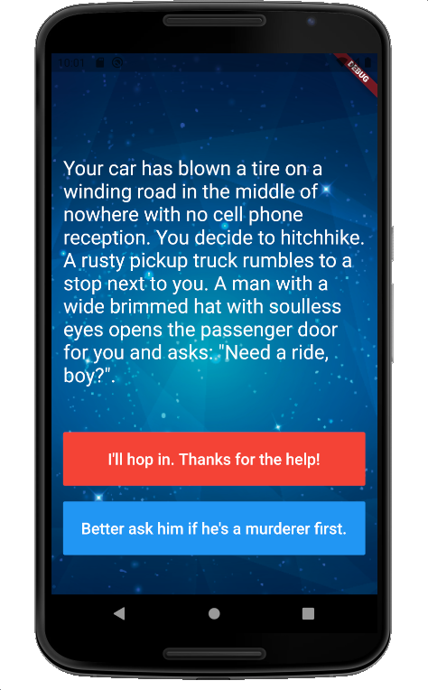
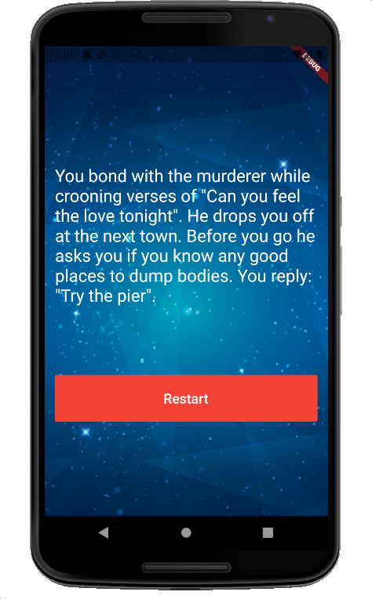
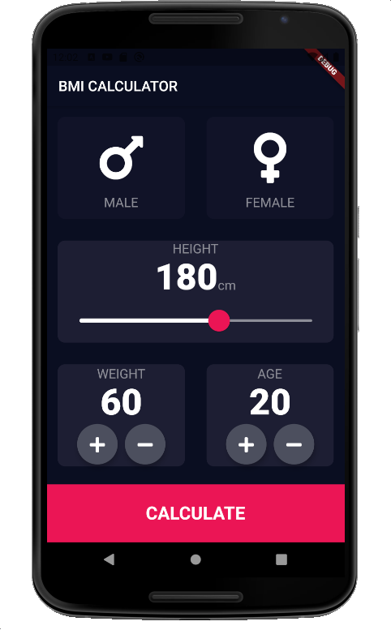
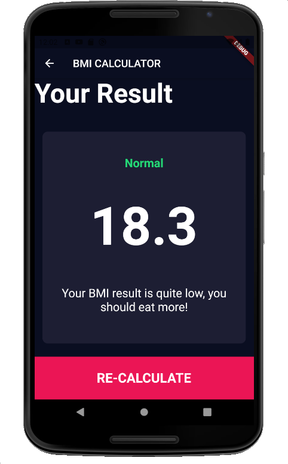

# udemy-introduction-to-flutter-development
Materi selengkapnya ada di https://www.appbrewery.co/courses/enrolled/851555. Semua materi bisa dijalankan dengan menggunakan minimum Flutter 1.22.

### 1. I Am Rich
Learn about MaterialApp, Container, Scaffold, Image, and add image assets to the screen.  

### 2. Mi Card
Learn about Column, Row, Main Axis Size and Alignment, CircleAvatar, Font TextStyle, add fonts assets, Card, ListTile, SizedBox, Divider.  

### 3. Dicee
Learn about Expanded to avoid overflow UI, Padding, and using Stateful Widget, create function.  

### 4. Magic 8 Ball
Recall all what we have learnt in this Boss Level Challenge 1. Using the stateful to update the ball state whenever it pressed.  

### 5. Xylophone
Learn how to play a sound with Audio Cache from Pub Dev.  

### 6. Quizzler
Learn to create data model, play with events, OOP in Dart, and using rflutter alert library to show the quiz score.  
&nbsp;
&nbsp;
&nbsp;

### 7. Destini
Recall all  what we have learnt for Boss level Challenge 2. Create data model, pass next story based on user choice.  
&nbsp;
&nbsp;

### 8. BMI Calculator
Learn to create custom components and interact with it, and learn how to move the next screen with Navigator and pass data from previous screen.  
&nbsp;
&nbsp;
