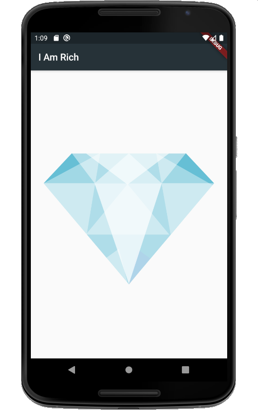
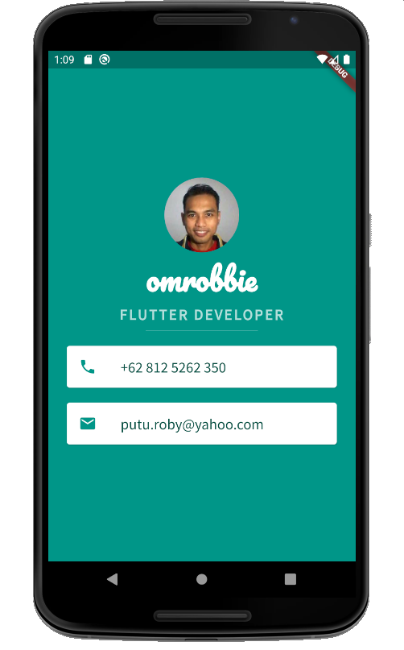
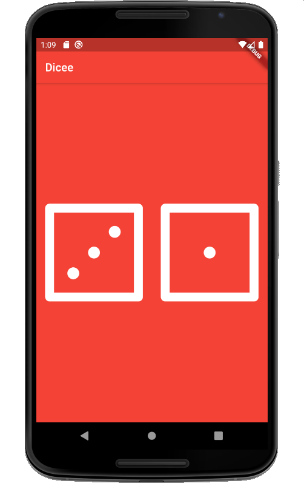
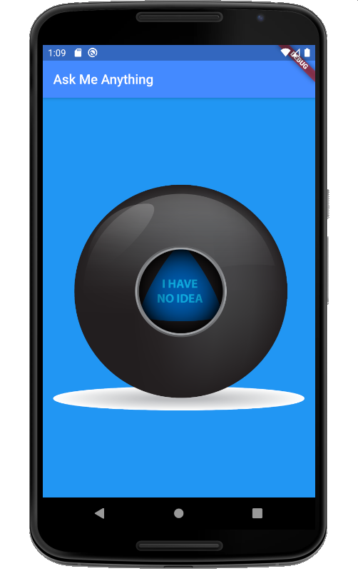
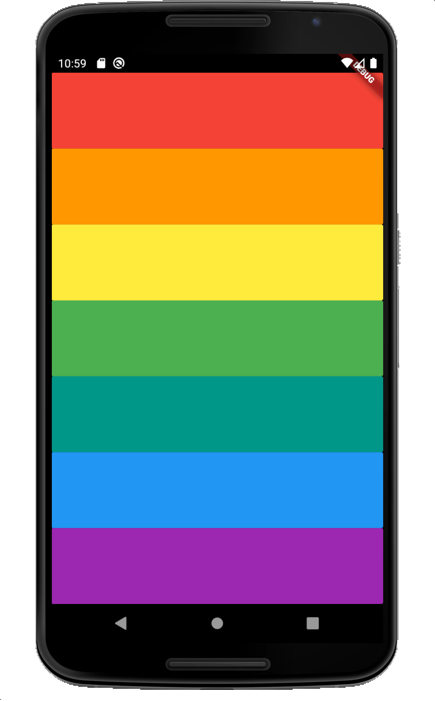
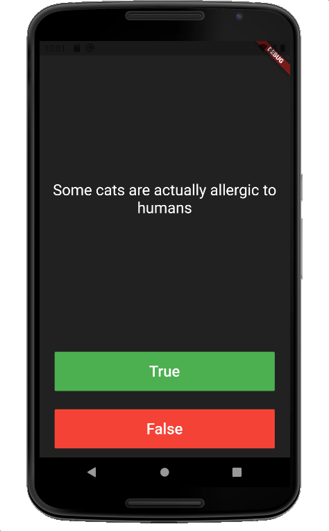
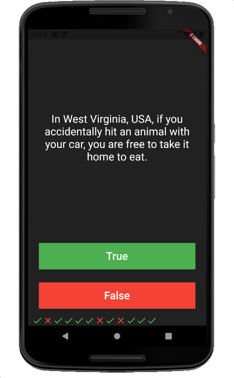
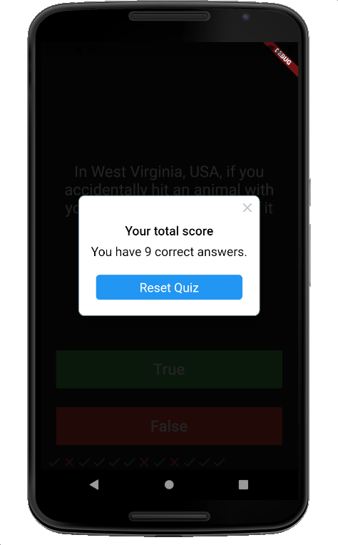

# udemy-introduction-to-flutter-development
Materi selengkapnya ada di https://www.appbrewery.co/courses/enrolled/851555. Semua materi bisa dijalankan dengan menggunakan minimum Flutter 1.22.

### 1. I Am Rich

Learn about MaterialApp, Container, Scaffold, Image, and add image assets to the screen.

### 2. Mi Card

Learn about Column, Row, Main Axis Size and Alignment, CircleAvatar, Font TextStyle, add fonts assets, Card, ListTile, SizedBox, Divider.

### 3. Dicee

Learn about Expanded to avoid overflow UI, Padding, and using Stateful Widget, create function.

### 4. Magic 8 Ball

Recall all what we have learnt in this Boss Level Challenge 1. Using the stateful to update the ball state whenever it pressed.

### 5. Xylophone

Learn how to play a sound with Audio Cache from Pub Dev.

### 6. Quizzler

Learn to create data model, play with events, OOP in Dart, and using rflutter alert library to show the quiz score.

&nbsp;
&nbsp;
&nbsp;
